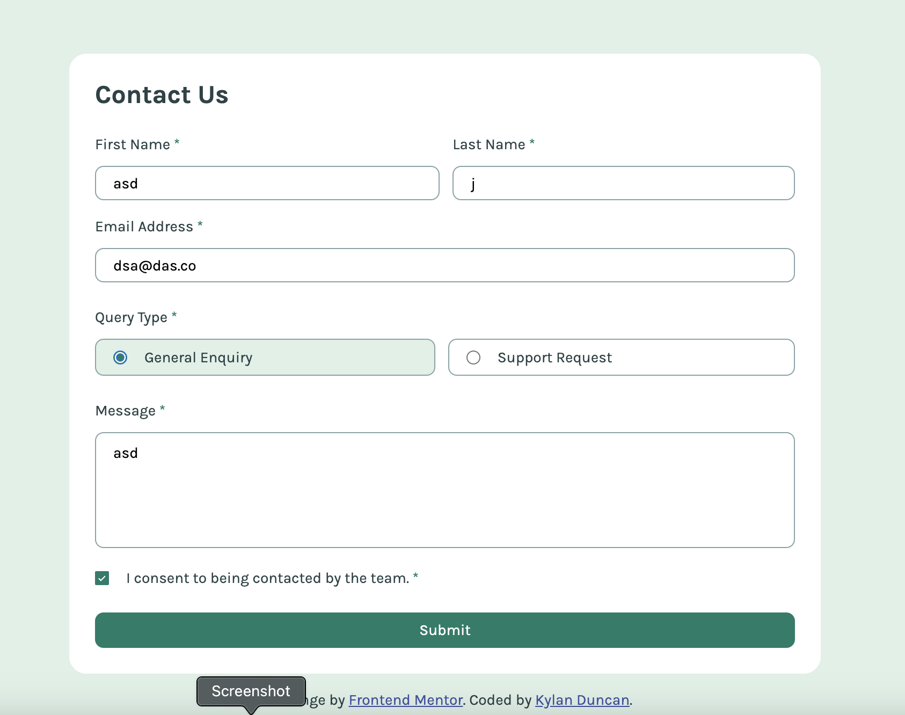

# Frontend Mentor - Contact form solution

This is a solution to the [Contact form challenge on Frontend Mentor](https://www.frontendmentor.io/challenges/contact-form--G-hYlqKJj). Frontend Mentor challenges help you improve your coding skills by building realistic projects. 

## Table of contents

- [Overview](#overview)
  - [The challenge](#the-challenge)
  - [Screenshot](#screenshot)
  - [Links](#links)
- [My process](#my-process)
  - [Built with](#built-with)
  - [What I learned](#what-i-learned)
  - [Continued development](#continued-development)
  - [Useful resources](#useful-resources)
- [Author](#author)

**Note: Delete this note and update the table of contents based on what sections you keep.**

## Overview

### The challenge

Users should be able to:

- Complete the form and see a success toast message upon successful submission
- Receive form validation messages if:
  - A required field has been missed
  - The email address is not formatted correctly
- Complete the form only using their keyboard
- Have inputs, error messages, and the success message announced on their screen reader
- View the optimal layout for the interface depending on their device's screen size
- See hover and focus states for all interactive elements on the page

### Screenshot

### Links

- Solution URL: [Add solution URL here](https://your-solution-url.com)
- Live Site URL: [Add live site URL here](https://your-live-site-url.com)

## My process

### Built with

- Semantic HTML5 markup
- CSS custom properties
- Flexbox
- Desktop-first workflow

### What I learned

I learned more about the `<form>` HTML element through completing this project, and what it means to do form validation. It was a bit trickier than I thought at first, as HTML5 comes with default validation that I realized that I didn't want to use for this solution. After a bit of research, this challenge became more straightforward.

### Continued development

If I were to continue this, I would:
- add functionality to submit responses to the specified email
- allow for multiple responses and keep track of response history
- try adding a dropdown for one of the options

### Useful resources

- [HTML Constraint Validation API](https://developer.mozilla.org/en-US/docs/Web/HTML/Constraint_validation) - Although I didn't use this for my final solution, this could be a helpful resource for when I'm feeling lazier making HTML forms.

## Author

- Website - [Kylan Duncan](https://www.cloudydaiyz.com)
- Frontend Mentor - [@cloudydaiyz](https://www.frontendmentor.io/profile/cloudydaiyz)